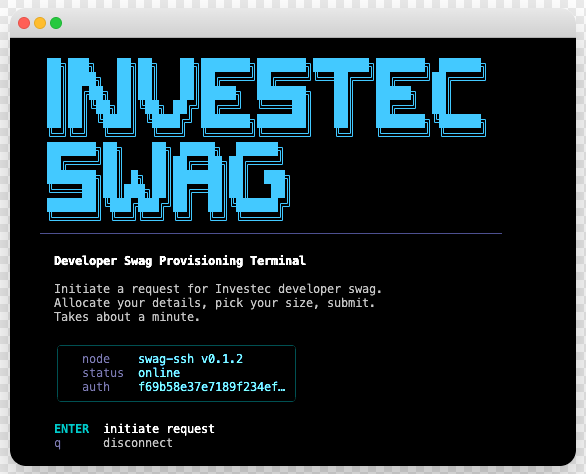

## ⚠️ Playground Project

This is **not an official Investec product**.

It's a community experiment --- a playground to test a fun, SSH-native
idea for developers in the [Investec Developer community](https://investec.gitbook.io/programmable-banking-community-wiki).

If you'd like to improve it, simplify it, or make it more ridiculous (in
a good way):

PRs welcome.

------------------------------------------------------------------------

# 🎁 Investec Developer Swag SSH Terminal

An SSH-first, ASCII-driven swag request experience for the Investec Developer Community.

Provision swag. Over SSH. Because we can.

```
ssh localhost -p 2222
```

<p align="center">
  
</p>

------------------------------------------------------------------------

## What is this?

A retro terminal interface powered by Go + Bubble Tea, backed by a
modern API and admin dashboard.

Developers SSH in, submit a swag request, and the DevRel team manages
approvals via a web dashboard.

Simple. Fast. Slightly over-engineered.

------------------------------------------------------------------------

## How It Works

| Interface | How | Tech |
|---|---|---|
| **SSH Terminal** | `ssh localhost -p 2222` | Go + Bubble Tea TUI |
| **REST API** | Backend for both interfaces | Hono.js on Bun |
| **Admin Dashboard** | Web UI for reviewing requests | React + Tailwind |

A developer SSHs in, fills out a quick form (name, email, phone, shirt size, why they deserve swag, and a full SA delivery address), and submits. A segmented progress bar tracks form completion, and an animated submission sequence gives visual feedback. The Investec DevRel team sees the request on the admin dashboard and can approve, deny, or waitlist it — with one-click copy for fulfilment.

---

## Architecture

```
                  ┌──────────────┐
                  │  Developer   │
                  │  (Terminal)  │
                  └──────┬───────┘
                         │ SSH (port 2222)
                         ▼
              ┌─────────────────────┐
              │   Go SSH Server     │
              │   (Bubble Tea TUI)  │
              └──────────┬──────────┘
                         │ HTTP
                         ▼
              ┌─────────────────────┐
              │   Hono.js API       │   ◄── Admin Dashboard (React)
              │   (Bun runtime)     │
              └──────────┬──────────┘
                         │
                         ▼
              ┌─────────────────────┐
              │   SQLite / Turso    │
              └─────────────────────┘
```

---

## Project Structure

```
investec-swag-ssh/
├── specs/                    # Product & technical specifications
│   ├── SPEC.md               # Product specification
│   ├── API_SPEC.md           # API & data layer spec
│   ├── SSH_TUI_SPEC.md       # SSH terminal UI spec
│   └── ADMIN_DASHBOARD_SPEC.md  # Admin web dashboard spec
├── packages/
│   ├── api/                  # Hono.js API backend
│   │   ├── src/
│   │   │   ├── index.ts      # Server entry point
│   │   │   ├── validators.ts # Zod schemas
│   │   │   ├── db/
│   │   │   │   ├── schema.ts # Drizzle ORM schema
│   │   │   │   ├── index.ts  # DB connection
│   │   │   │   └── seed.ts   # Seed admin user
│   │   │   ├── routes/
│   │   │   │   ├── requests.ts # Request CRUD
│   │   │   │   ├── stats.ts    # Dashboard stats
│   │   │   │   └── auth.ts     # Admin login
│   │   │   └── middleware/
│   │   │       └── auth.ts     # JWT auth middleware
│   │   └── drizzle.config.ts
│   ├── ssh/                   # Go SSH server + TUI
│   │   ├── cmd/ssh/main.go    # SSH server entry point
│   │   ├── pkg/
│   │   │   ├── api/client.go  # API client
│   │   │   └── tui/
│   │   │       ├── root.go    # Main model (Init/Update/View)
│   │   │       ├── splash.go  # Splash screen + ASCII art
│   │   │       ├── form.go    # Multi-step swag form (9 steps)
│   │   │       ├── review.go  # Review before submit
│   │   │       ├── confirm.go # Success & error screens
│   │   │       ├── progress.go # Progress bar + submission animation
│   │   │       ├── rickroll.go # Easter egg 🤫
│   │   │       └── theme/
│   │   │           └── investec.go  # Brand colors (95/5 palette)
│   │   ├── go.mod
│   │   └── Makefile
│   └── admin/                 # React admin dashboard
│       ├── src/
│       │   ├── main.tsx       # Entry point
│       │   ├── App.tsx        # Router
│       │   ├── lib/api.ts     # API client + types
│       │   ├── hooks/useAuth.ts
│       │   ├── pages/
│       │   │   ├── LoginPage.tsx
│       │   │   └── DashboardPage.tsx
│       │   └── components/
│       │       ├── Header.tsx
│       │       ├── StatsCards.tsx
│       │       ├── StatusBadge.tsx
│       │       └── RequestDetail.tsx
│       ├── vite.config.ts
│       └── tailwind.config.ts
├── package.json               # Workspace root
├── AGENTS.md                  # Dev guide for AI agents
└── README.md                  # This file
```

---

## Quick Start

### Prerequisites

- [Bun](https://bun.sh) >= 1.1
- [Go](https://go.dev) >= 1.22
- Node.js >= 20 (for admin dashboard tooling)

> **macOS without Homebrew?** Install Bun and Go directly:
> ```bash
> # Install Bun
> curl -fsSL https://bun.sh/install | bash
> source ~/.zshrc
>
> # Install Go (Apple Silicon)
> curl -fsSL https://go.dev/dl/go1.22.5.darwin-arm64.tar.gz -o /tmp/go.tar.gz
> mkdir -p ~/go-sdk && tar -C ~/go-sdk -xzf /tmp/go.tar.gz && rm /tmp/go.tar.gz
> echo 'export GOROOT=$HOME/go-sdk/go' >> ~/.zshrc
> echo 'export PATH=$GOROOT/bin:$HOME/go/bin:$PATH' >> ~/.zshrc
> source ~/.zshrc
> ```

### 1. Install dependencies

```bash
bun install
```

### 2. Set up environment

```bash
cp .env.example .env
```

Edit `.env` if you need to change any defaults (ports, credentials, etc.).

### 3. Set up database

```bash
# Create data directory
mkdir -p packages/api/data

# Push schema to SQLite (run from api package)
cd packages/api && bunx drizzle-kit push && cd ../..

# Seed admin user
cd packages/api && bun src/db/seed.ts && cd ../..
```

> **Note:** The root `bun db:push` and `bun db:seed` scripts use `bun --cwd` which may not be supported on all Bun versions. If they fail, use the direct commands above.

### 4. Start development servers

```bash
# Terminal 1: API server
cd packages/api && bun --hot src/index.ts

# Terminal 2: Admin dashboard
cd packages/admin && bun run dev

# Terminal 3: SSH server
cd packages/ssh && go run ./cmd/ssh/main.go
```

> If Go dependencies haven't been fetched yet, run `go mod tidy` inside `packages/ssh/` first.

### 4. Test SSH locally

```bash
ssh localhost -p 2222
```

### 5. Open admin dashboard

```
http://localhost:5173
```

Default admin credentials:
- Email: `admin@investec.com`
- Password: `changeme123`

> **SSH host key warning?** If you see "REMOTE HOST IDENTIFICATION HAS CHANGED", the server generated a new key. Fix with:
> ```bash
> ssh-keygen -R "[localhost]:2222"
> ```

---

## API Routing

| Path | Auth | Description |
|------|------|-------------|
| `POST /api/requests` | None | Submit a swag request (SSH TUI) |
| `POST /api/auth/login` | None | Admin login |
| `GET /api/admin/requests` | JWT | List requests (admin) |
| `GET /api/admin/requests/:id` | JWT | Get request detail |
| `PATCH /api/admin/requests/:id/status` | JWT | Approve/deny/waitlist |
| `GET /api/admin/stats` | JWT | Dashboard statistics |

---

## Commands Reference

| Command | Description |
|---------|-------------|
| `bun dev` | Run API + Admin in dev mode |
| `bun dev:ssh` | Run SSH server locally |
| `bun build` | Build API + Admin for production |
| `bun build:ssh` | Build Go SSH binary |
| `bun db:push` | Apply database schema |
| `bun db:studio` | Open Drizzle Studio |
| `bun db:seed` | Seed admin user |
| `bun test` | Run API tests |
| `bun typecheck` | TypeScript type checking |

---

## Technology Stack

| Layer | Technology | Purpose |
|-------|-----------|---------|
| SSH Server | Go + Bubble Tea + Wish | Interactive terminal UI over SSH |
| API | Hono.js + Bun | REST API backend |
| Database | SQLite (bun:sqlite) + Drizzle ORM | Data persistence |
| Validation | Zod | Input validation + OpenAPI |
| Admin UI | React + Vite + Tailwind | Admin web dashboard |
| State | TanStack Query | Server state management |

> **Note:** The database driver uses Bun's built-in `bun:sqlite` module (not `better-sqlite3`). The `better-sqlite3` package remains in `package.json` for `drizzle-kit` CLI compatibility (which runs under Node).

---

## Inspired By

[terminal.shop](https://terminal.shop) — the SSH-first e-commerce experience. This project takes the same architectural patterns (Go Bubble Tea TUI → REST API → Admin web) and applies them to a community swag request workflow.